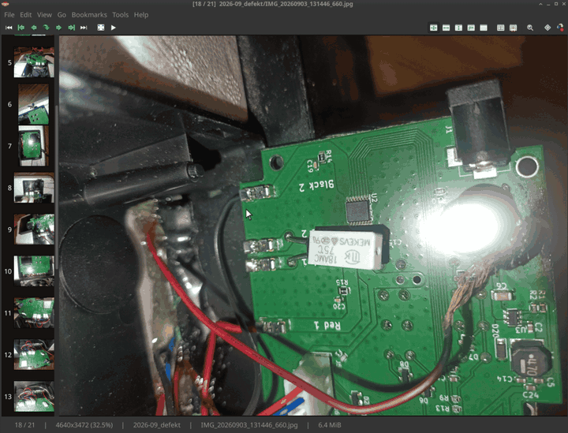

# MComix Debian package with local patches

This repository is a small, unofficial packaging workspace based on the
[official Debian MComix package](https://tracker.debian.org/pkg/mcomix). It
combines Debian's packaging with the current
[upstream MComix 3.2.0 release](https://sourceforge.net/projects/mcomix/files/MComix-3.2.0/)
and a handful of focused local patches. It is not a separate MComix fork.

## Local patches

- `01_fix_ftbfs.patch` includes the missing `setup.cfg` in the source manifest
  so the package builds correctly.
- `02_ignore_invalid_cached_thumbnails.patch` regenerates cached thumbnails
  whose metadata is missing or invalid instead of failing.
- `03_increase_magnifying_lens_size_limit.patch` raises the maximum magnifying
  lens size to 2000 pixels.
- `04_add_ai_image_tools.patch` adds two OpenAI-compatible tools: ask questions
  about the current image and transform it. Text and image services have
  independent endpoint, API key, model, and timeout settings. Generated images
  are reversible session-only page overrides.
- `05_persist_preferences_on_dialog_close.patch` saves changed preferences as
  soon as the Preferences dialog closes, including the AI configuration.

## AI feature demo

[](ai_peek.mp4)

Click the preview to open the original H.264 video.

## Building

The source tree is in `mcomix-3.2.0/`. Build the source package from the
repository root and the binary package from inside the source tree:

```sh
dpkg-source -b mcomix-3.2.0
cd mcomix-3.2.0
dpkg-buildpackage -us -uc -b
```
